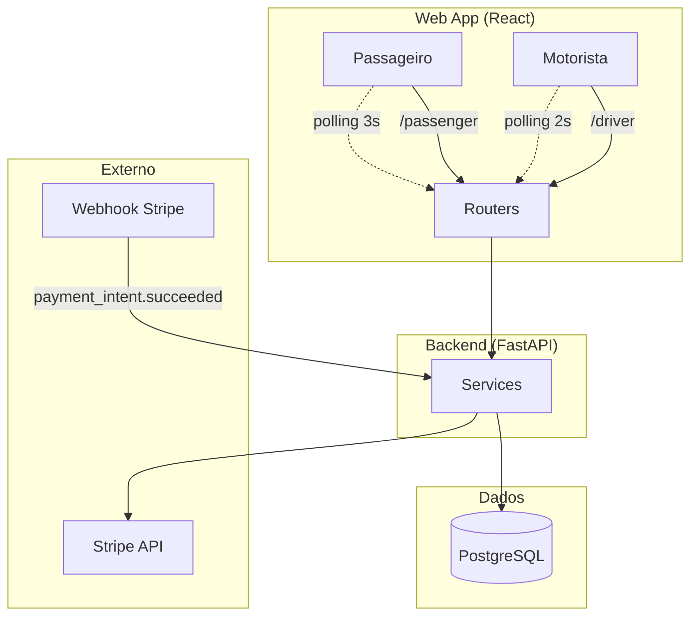
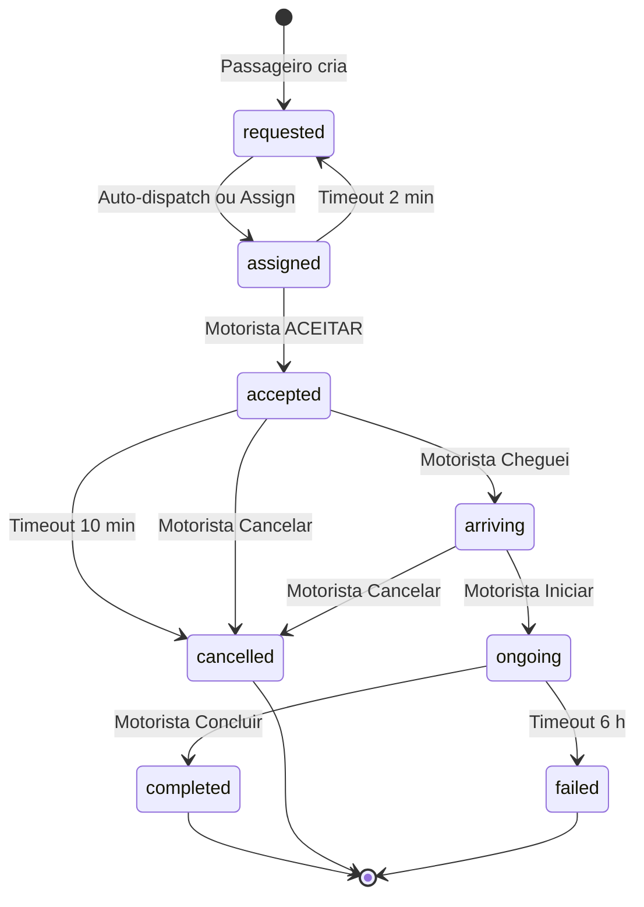
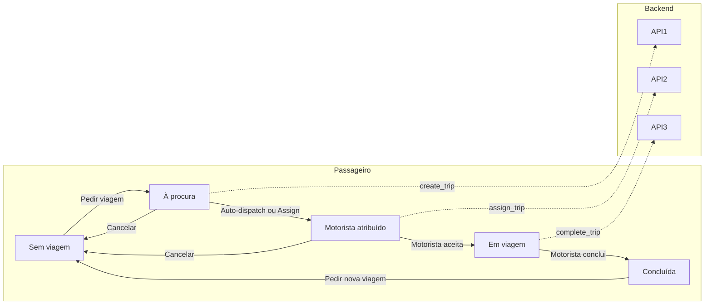
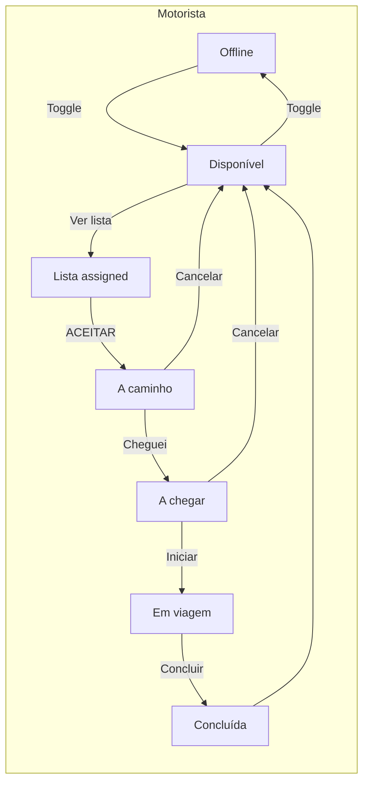
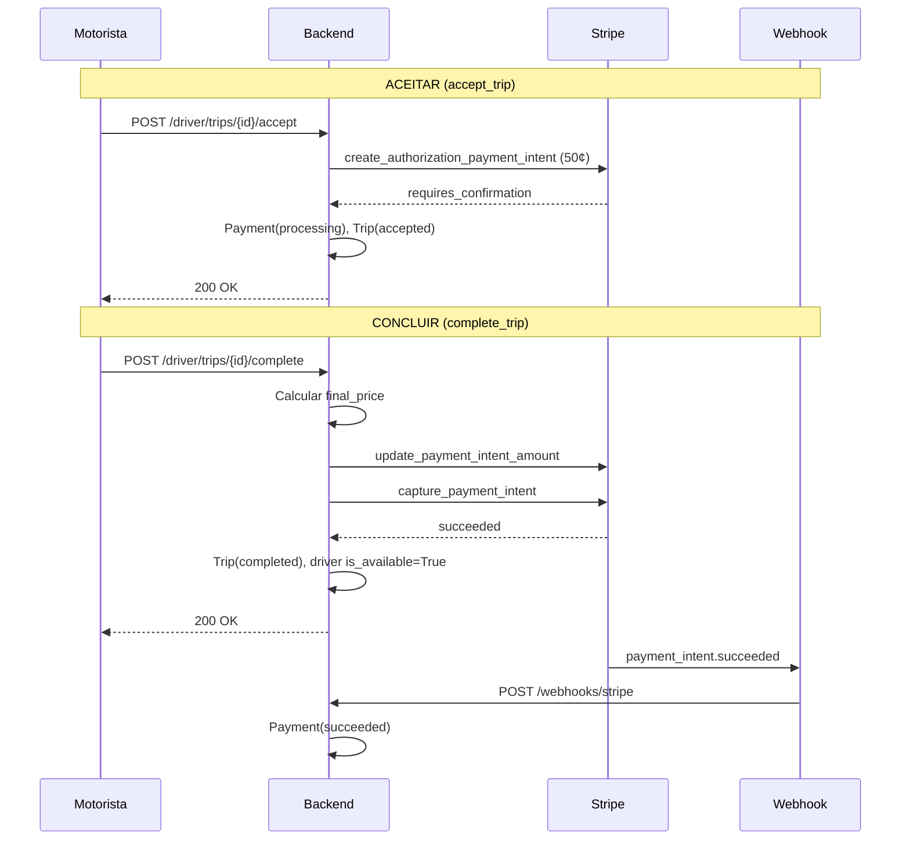
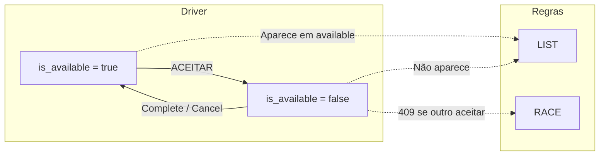

# Circuitos da App TVDE — Resumo Gráfico

Diagramas dos fluxos principais. Renderiza em [GitHub](https://github.com), [Mermaid Live](https://mermaid.live) ou extensões Markdown com suporte Mermaid.

---

## 1. Arquitetura Geral



---

## 2. State Machine da Viagem



---

## 3. Fluxo Passageiro



---

## 4. Fluxo Motorista



---

## 5. Fluxo Stripe (Accept → Complete)



---

## 6. Endpoints por Actor

```mermaid
flowchart TB
    subgraph Passageiro
        P1[POST /trips - criar]
        P2[GET /trips/history]
        P3[GET /trips/{id}]
        P4[POST /trips/{id}/cancel]
    end

    subgraph Motorista
        D1[GET /driver/trips/available]
        D2[POST /driver/trips/{id}/accept]
        D3[POST /driver/trips/{id}/arriving]
        D4[POST /driver/trips/{id}/start]
        D5[POST /driver/trips/{id}/complete]
        D6[POST /driver/trips/{id}/cancel]
    end

    subgraph Admin
        A1[POST /admin/run-timeouts]
        A2[POST /admin/trips/{id}/assign]
    end

    subgraph Dev
        DEV1[POST /dev/seed]
        DEV2[POST /dev/tokens]
        DEV3[POST /dev/auto-trip]
    end
```

---

## 7. Disponibilidade do Motorista



---

## Legenda

| Símbolo | Significado |
|---------|-------------|
| `-->` | Transição / chamada |
| `-.->` | Polling / assíncrono |
| `[*]` | Estado inicial/final |
