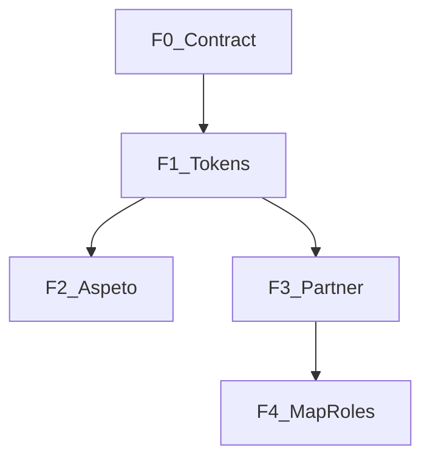

# Ambiance / Chrome — build plan

**North star:** presença contida — ambiance altera chrome (sheets, menus, cards, headers), **nunca** tiles do mapa nem cores semânticas de estados críticos.

Inspiração Sueca: **mecanismos** (camadas, preview, hierarquia), não estética (30 temas, lore, editor).

---

## Artefactos

| Ficheiro | Conteúdo |
|----------|----------|
| [`AMBIANCE_CHROME_BUILD.md`](AMBIANCE_CHROME_BUILD.md) | Este ficheiro — índice master |
| [`../ux/ambiance-chrome-contract.md`](../ux/ambiance-chrome-contract.md) | Contrato técnico (tokens, matriz, proibidos) |
| [`../prompts/ambiance/PROMPT_AMB_F0_CONTRACT.md`](../prompts/ambiance/PROMPT_AMB_F0_CONTRACT.md) | Prompt F0 — doc-only |
| [`../prompts/ambiance/PROMPT_AMB_F1_CHROME_TOKENS.md`](../prompts/ambiance/PROMPT_AMB_F1_CHROME_TOKENS.md) | Prompt F1 — tokens CSS |
| [`../prompts/ambiance/PROMPT_AMB_F2_ASPETO_UI.md`](../prompts/ambiance/PROMPT_AMB_F2_ASPETO_UI.md) | Prompt F2 — selector |
| [`../prompts/ambiance/PROMPT_AMB_F3_PARTNER_CRAFT.md`](../prompts/ambiance/PROMPT_AMB_F3_PARTNER_CRAFT.md) | Prompt F3 — partner |
| [`../prompts/ambiance/PROMPT_AMB_F4_MAP_ROLES.md`](../prompts/ambiance/PROMPT_AMB_F4_MAP_ROLES.md) | Prompt F4 — driver/passenger |

### Referências existentes

- Temas: [`web-app/src/hooks/useTheme.ts`](../../web-app/src/hooks/useTheme.ts), [`web-app/src/design-system/themes/`](../../web-app/src/design-system/themes/)
- Mapa/sheets: [`web-app/src/components/layout/infoBoxTemplate.ts`](../../web-app/src/components/layout/infoBoxTemplate.ts), [`../ux/info-box-template.md`](../ux/info-box-template.md)
- Menu IA: [`../ux/shell-menu-centric.md`](../ux/shell-menu-centric.md)
- Aspeto: [`web-app/src/features/settings/AppAppearanceSettings.tsx`](../../web-app/src/features/settings/AppAppearanceSettings.tsx)

---

## Fases

| Fase | Nome | Código? | Risco | Gate |
|------|------|---------|-------|------|
| **F0** | Contrato ambiance | Não | Baixo | Doc aprovado |
| **F1** | Tokens chrome | Sim | Médio | Build + smoke 4 temas × piloto |
| **F2** | Ecrã Aspeto | Sim | Baixo | Preview honesto com F1 |
| **F3** | Partner craft | Sim | Médio | Partner smoke; menu drawer → F3b |
| **F4** | Map roles micro | Sim | Alto | Driver/passenger smoke mapa |

**Ordem:** uma branch/PR por fase; merge + smoke antes da seguinte.

---

## Não-fazer (global)

- Novos `ThemeId` ou renomear labels UI sem pedido explícito
- Refactor `AppMenuShell` / unificar SideMenus transversalmente
- Alterar árvore menu v2 ([`shell-menu-centric.md`](../ux/shell-menu-centric.md))
- Filtrar ou estilizar tiles do mapa ([`MapView.tsx`](../../web-app/src/maps/MapView.tsx))
- Mudar cores semânticas fixas por tema
- Prompt multi-fase numa só execução Agent
- Clonar ou tocar repo Sueca

---

## Gates de qualidade

- Contraste: texto legível em sheet sobre mapa
- Auto: `prefers-color-scheme` → portugal/dev
- `cd web-app && npm run build`
- Lint nos ficheiros tocados
- E2E existentes da role afectada

---

## Critério de sucesso

Ambiance coerente no chrome sem perder legibilidade operacional; Partner com identidade; mapa roles com polish mínimo; zero refactor shell transversal não planeado.

---

## Estado de implementação (F0–F4)

| Fase | Estado | Notas |
|------|--------|-------|
| F0 | Concluído | [`ambiance-chrome-contract.md`](../ux/ambiance-chrome-contract.md) |
| F1 | Concluído | Tokens + piloto `MAP_BOTTOM_SHEET`, `MENU_SURFACE`, `MENU_ROW_BTN` |
| F2 | Concluído | `ThemeSelector` cards + `ambianceMeta.ts` |
| F3 | Concluído | Partner dashboard, hubs, alerts; **F3b menu drawer pendente** |
| F4 | Concluído | Resto `infoBoxTemplate` mapa/chips; menus já usam `MENU_*` |

**Fora de scope (mantido):** AppMenuShell unificado, novos temas, tiles mapa, PartnerSideMenu identidade (F3b).
