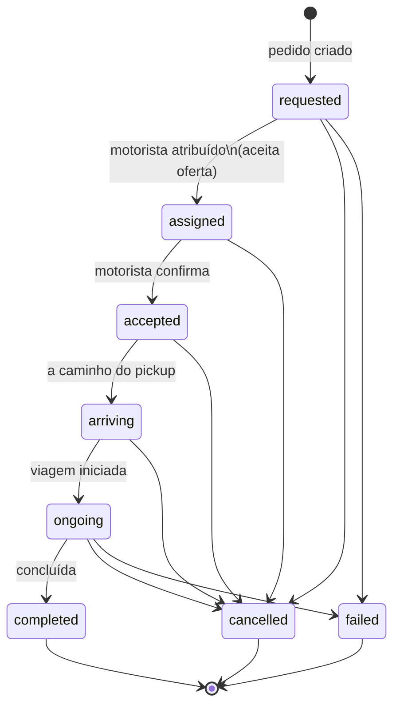

# Diagrama — ciclo de viagem (`TripStatus`)

Fonte de verdade dos valores: `backend/app/models/enums.py` → `TripStatus`.

Este diagrama mostra o **percurso feliz** e saídas **cancelled** / **failed** comuns; há transições adicionais no serviço de viagens (ex.: re-oferta, timeouts) — ver código para o detalhe completo.

## Leitura cruzada

- Ofertas e re-dispatch: [02_OFFERS.md](02_OFFERS.md)
- Pagamento em paralelo ao estado da viagem: [03_PAYMENTS.md](03_PAYMENTS.md)
