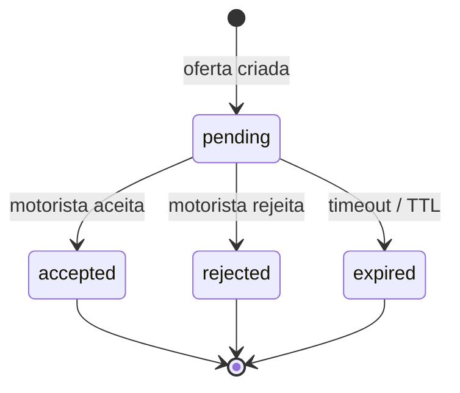

# Diagrama — ofertas ao motorista (`OfferStatus`)

Cada pedido em `requested` pode gerar **várias ofertas** (top N motoristas). Estados da oferta em `backend/app/models/enums.py` → `OfferStatus`.

## Nota operacional

- Viagens em `requested` com **todas** as ofertas `rejected` ou `expired` podem ser reencaminhadas (lógica em `offer_dispatch` e serviços de viagem — ver código).

Índice: [README.md](README.md)
