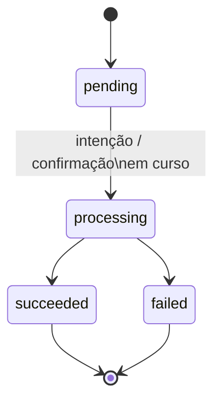
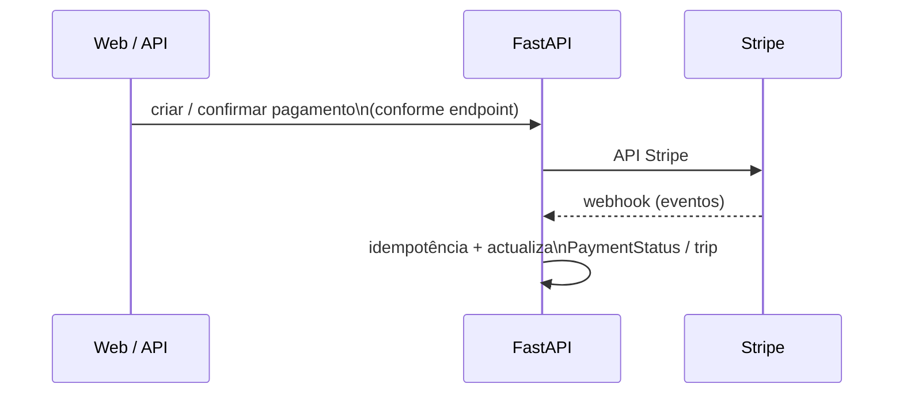

# Diagrama — pagamento (`PaymentStatus` + Stripe)

Estados internos em `PaymentStatus` (`enums.py`). A captura/autorização concreta segue a política documentada em `docs/PRICING_DECISION.md` e testes Stripe.

## Fluxo externo (alto nível)

## Eventos Stripe tratados no webhook

Endpoint: `POST /webhooks/stripe` (`backend/app/api/routers/webhooks/stripe.py`). Só altera `Payment` quando existe linha com `stripe_payment_intent_id` = `pi_…` deduzido do evento. **Idempotência:** `stripe_event_id` (prefixo `evt_`) em `StripeWebhookEvent` — reentrega = ack 200 sem duplicar efeito.

| `event_type` (Stripe) | Efeito na nossa `Payment` |
| ----------------------- | ------------------------- |
| `payment_intent.succeeded` | `PaymentStatus` → **succeeded** (se ainda não estava) |
| `payment_intent.payment_failed` | → **failed** |
| `charge.payment_failed` | → **failed** (resolve `payment_intent` a partir do charge) |

Outros tipos: ack **200** sem mudar pagamento (ou log + skip se não houver `pi_` válido).

Índice: [README.md](README.md)
