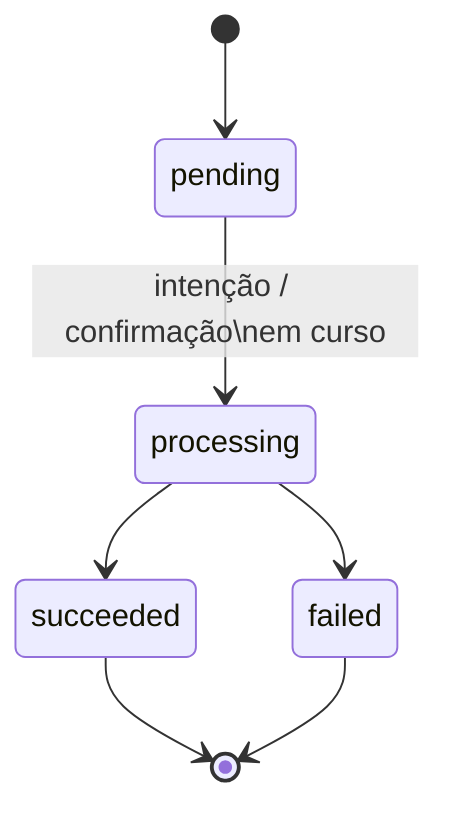
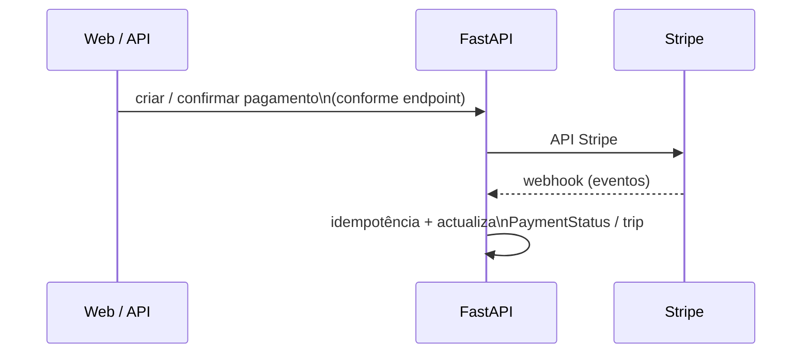

# Diagrama — pagamento (`PaymentStatus` + Stripe)

Estados internos em `PaymentStatus` (`enums.py`). A captura/autorização concreta segue a política documentada em `docs/PRICING_DECISION.md` e testes Stripe.

## Fluxo externo (alto nível)

Índice: [README.md](README.md)
