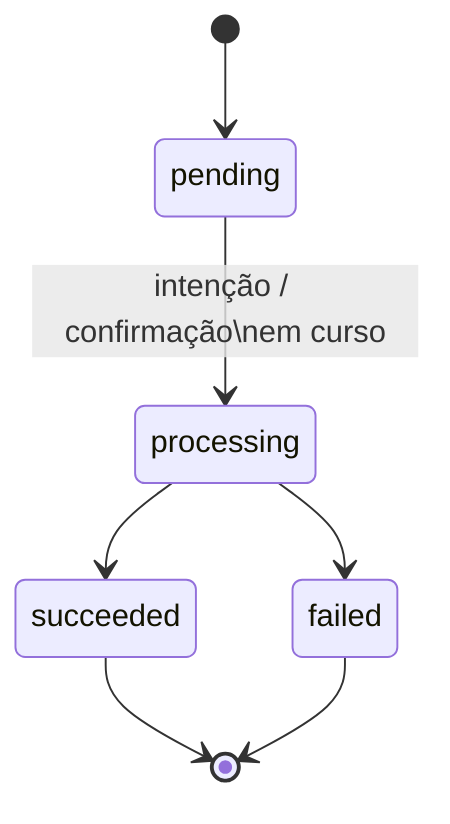
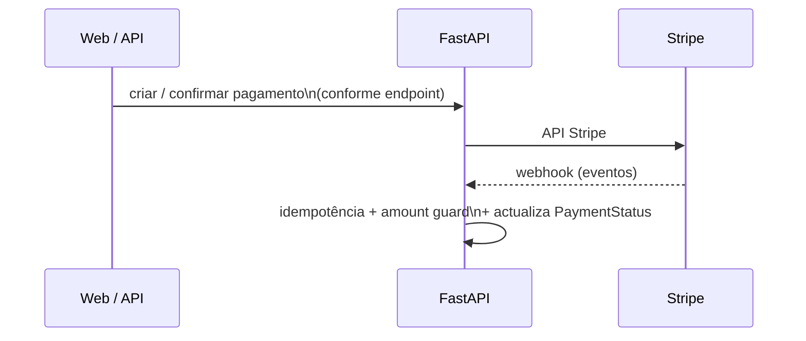

# Diagrama — pagamento (`PaymentStatus` + Stripe)

Estados internos em `PaymentStatus` (`enums.py`). A captura/autorização concreta segue a política documentada em `docs/PRICING_DECISION.md` e testes Stripe.

```mermaid
stateDiagram-v2
  [*] --> pending

  pending --> processing: intenção / confirmação\nem curso
  processing --> succeeded
  processing --> failed

  succeeded --> [*]
  failed --> [*]
```

## Fluxo cartão V1 (manual capture)

1. **Accept:** cria PaymentIntent `capture_method=manual`, `payment_method_types=["card"]`, amount **€0,50** (placeholder Stripe EUR). `Payment.status=processing`.
2. **Complete:** calcula `final_price` → `update` amount → `confirm` → `capture` (quando PI ainda não está `requires_capture`).
3. **Webhook** `payment_intent.succeeded`: marca `Payment.succeeded` **só** se amount/currency coincidem com `final_price` (ou `total_amount`).
4. **Fail-closed:** PI em `requires_capture` com amount ≠ final (ex. placeholder ainda €0,50) → **não** capturar; log `payment_capture_blocked_amount_mismatch`; payment permanece `processing` para ops.

`ENABLE_CONFIRM_ON_ACCEPT` / `client_secret` antecipado: **desligado em prod e staging live**. Dev/test (e staging com `STRIPE_MOCK=true`) podem usar a flag para testes.

**MB WAY:** fase 2 — não usa este fluxo de hold; ver discovery A1.2.

## Fluxo externo (alto nível)

```mermaid
sequenceDiagram
  participant App as Web / API
  participant API as FastAPI
  participant S as Stripe

  App->>API: criar / confirmar pagamento\n(conforme endpoint)
  API->>S: API Stripe
  S-->>API: webhook (eventos)
  API->>API: idempotência + amount guard\n+ actualiza PaymentStatus
```

## Eventos Stripe tratados no webhook

Endpoint: `POST /webhooks/stripe` (`backend/app/api/routers/webhooks/stripe.py`). Só altera `Payment` quando existe linha com `stripe_payment_intent_id` = `pi_…` deduzido do evento. **Idempotência:** `stripe_event_id` (prefixo `evt_`) em `StripeWebhookEvent` — reentrega = ack 200 sem duplicar efeito.

| `event_type` (Stripe) | Efeito na nossa `Payment` |
| ----------------------- | ------------------------- |
| `payment_intent.succeeded` | → **succeeded** se amount/currency OK; senão log mismatch e **mantém** `processing` |
| `payment_intent.payment_failed` | → **failed** |
| `charge.payment_failed` | → **failed** (resolve `payment_intent` a partir do charge) |

Outros tipos: ack **200** sem mudar pagamento (ou log + skip se não houver `pi_` válido).

Admin reconcile (`stripe-sync` / single): a mesma regra — Stripe `succeeded` **não** basta sem amount/currency alinhados.

Índice: [README.md](README.md)
