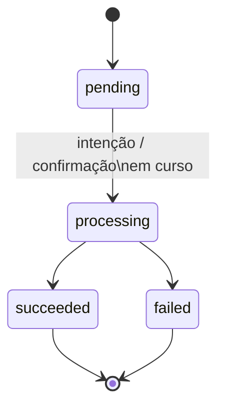
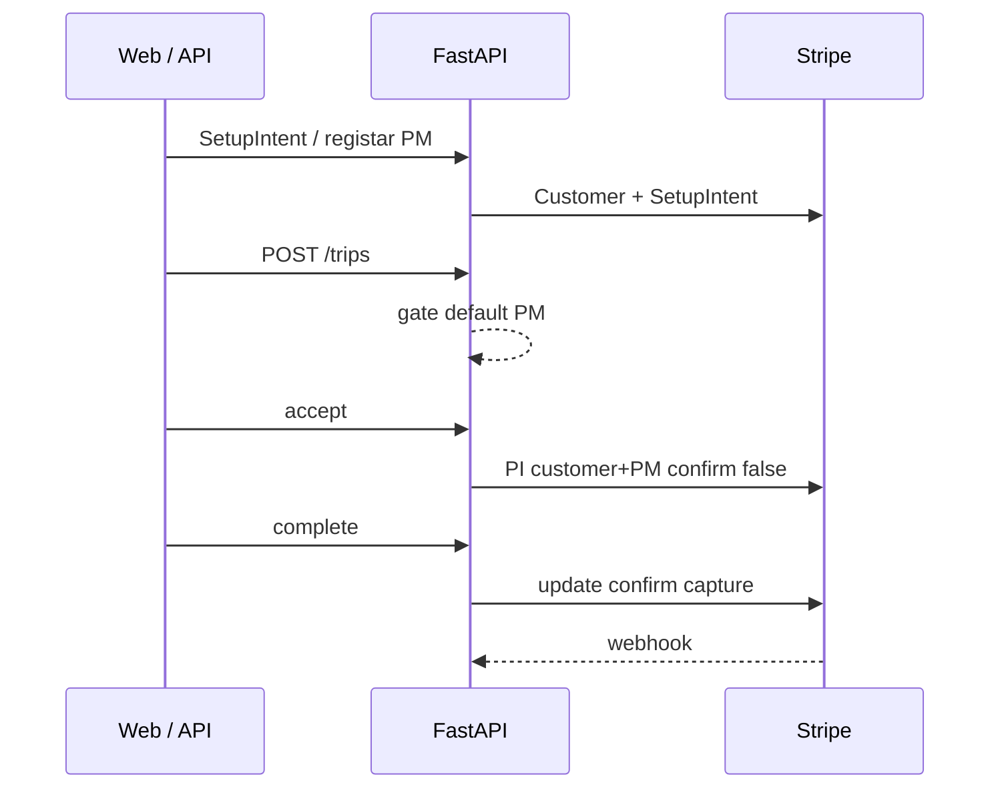

# Diagrama — pagamento (`PaymentStatus` + Stripe)

Estados internos em `PaymentStatus` (`enums.py`). A captura/autorização concreta segue a política documentada em `docs/PRICING_DECISION.md` e testes Stripe.

```mermaid
stateDiagram-v2
  [*] --> pending

  pending --> processing: intenção / confirmação\nem curso
  processing --> succeeded
  processing --> failed

  succeeded --> [*]
  failed --> [*]
```

## Fluxo cartão V1 (manual capture) — pagamento preparado antes do pedido

1. **Wallet (pré-trip):** Passageiro cria SetupIntent (`POST /payments/setup-intent`), confirma cartão (SCA no SetupIntent se necessário), regista PM (`POST /payments/methods` só com SetupIntent `succeeded` do próprio Customer). Primeiro PM = default (Stripe autoridade + cache DB).
2. **Create trip:** com `STRIPE_MOCK=false`, exige Customer + default PM → senão **402** `payment_method_required` (sem criar Trip). Mock não bloqueia.
3. **Accept:** cria PaymentIntent `capture_method=manual`, `confirm=False`, amount **€0,50**, com `customer` + `payment_method` default. `Payment.status=processing`. Guarda `payments.stripe_payment_method_id`.
4. **Complete:** calcula `final_price` → `update` amount → `confirm` (SCA possível → 409 `payment_requires_action`) → `capture`. Fallback defensivo `payment_method_required` se PM em falta. Attach tardio (`POST /trips/{id}/payment-method`) permanece só como fallback — **não** faz parte do fluxo normal.
5. **Webhook** `payment_intent.succeeded`: marca `Payment.succeeded` **só** se amount/currency coincidem com `final_price` (ou `total_amount`).
6. **Detach:** bloqueado se o PM estiver em Trip activa (`accepted` / `arriving` / `ongoing` / `assigned`) → `409 payment_method_in_use`.
7. **Fail-closed:** PI em `requires_capture` com amount ≠ final → **não** capturar; log `payment_capture_blocked_amount_mismatch`.

### SCA / 3DS

| Momento | Onde |
|---------|------|
| Adicionar cartão | `confirmCardSetup` (SetupIntent) |
| Cobrança final | `PaymentIntent.confirm` no complete → cliente trata `payment_requires_action` |

Não se pede introdução de cartão em `requested → matching → accepted → arriving → ongoing`.

`ENABLE_CONFIRM_ON_ACCEPT` / confirm antecipado do placeholder: **continua desligado em prod e staging live**.

**MB WAY:** fase 2 — não usa este fluxo de hold; ver discovery A1.2.

**Piloto V1:** refunds manuais no Dashboard — [`docs/runbooks/PILOT_STRIPE_REFUND.md`](../runbooks/PILOT_STRIPE_REFUND.md). Inconsistências: [`docs/runbooks/PILOT_PAYMENT_RECONCILIATION.md`](../runbooks/PILOT_PAYMENT_RECONCILIATION.md).

## Fluxo externo (alto nível)

```mermaid
sequenceDiagram
  participant App as Web / API
  participant API as FastAPI
  participant S as Stripe

  App->>API: SetupIntent / registar PM
  API->>S: Customer + SetupIntent
  App->>API: POST /trips
  API-->>API: gate default PM
  App->>API: accept
  API->>S: PI customer+PM confirm false
  App->>API: complete
  API->>S: update confirm capture
  S-->>API: webhook
```

## Eventos Stripe tratados no webhook

Endpoint: `POST /webhooks/stripe` (`backend/app/api/routers/webhooks/stripe.py`). Só altera `Payment` quando existe linha com `stripe_payment_intent_id` = `pi_…` deduzido do evento. **Idempotência:** `stripe_event_id` (prefixo `evt_`) em `StripeWebhookEvent` — reentrega = ack 200 sem duplicar efeito.

| `event_type` (Stripe) | Efeito na nossa `Payment` |
| ----------------------- | ------------------------- |
| `payment_intent.succeeded` | → **succeeded** se amount/currency OK; senão log mismatch e **mantém** `processing` |
| `payment_intent.payment_failed` | → **failed** |
| `charge.payment_failed` | → **failed** (resolve `payment_intent` a partir do charge) |

Outros tipos: ack **200** sem mudar pagamento (ou log + skip se não houver `pi_` válido).

Admin reconcile (`stripe-sync` / single): a mesma regra — Stripe `succeeded` **não** basta sem amount/currency alinhados.

Índice: [README.md](README.md)
