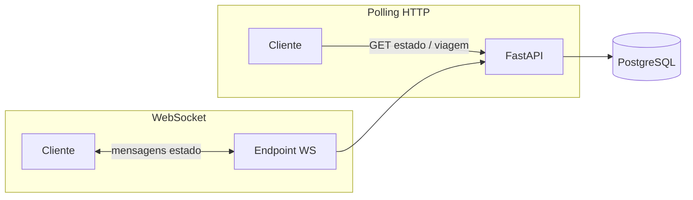

# Diagrama — tempo real (HTTP + WebSocket)

A web-app usa **REST** para a maior parte das acções e **WebSocket** onde o produto exige push de estado (ex.: motorista / passageiro em viagem). O desenho abaixo é **genérico**; nomes de tópicos e rotas estão no código (`web-app` + routers FastAPI).

## Quando expandir este doc

- Sequence diagram por papel (passageiro vs motorista) com eventos reais dos hooks do frontend.
- Referência cruzada com [01_TRIP_LIFECYCLE.md](01_TRIP_LIFECYCLE.md).

Índice: [README.md](README.md)
