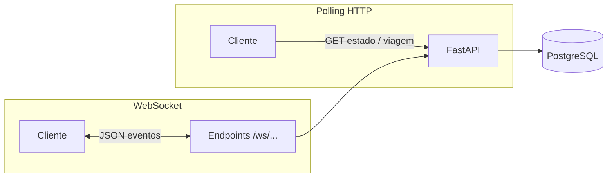
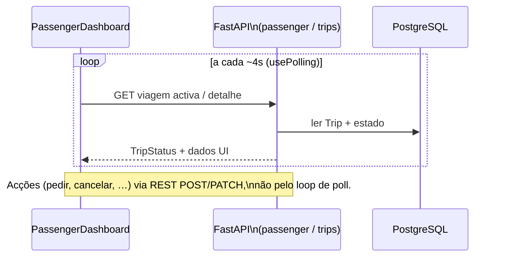
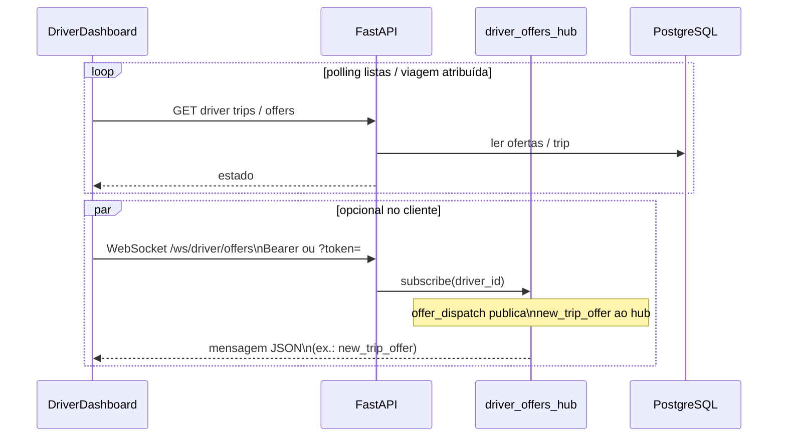
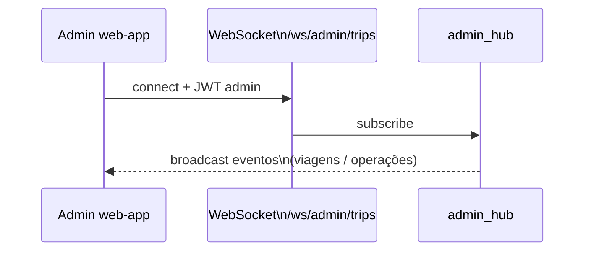

# Diagrama — tempo real (HTTP + WebSocket)

A **web-app** usa sobretudo **polling HTTP** (`usePolling`, intervalos da ordem dos **segundos** — ex.: ~4s no passageiro). O **backend** expõe **WebSockets** para subscrições por `trip_id`, por motorista (ofertas) e admin; o cliente pode passar a consumi-los sem mudar a API.

Rotas WS: `backend/app/api/routers/ws.py` (`/ws/trips/{trip_id}`, `/ws/driver/offers`), `admin_ws.py` (`/ws/admin/trips`). Auth: header `Authorization: Bearer` ou query `?token=`.

## Passageiro — polling de viagem activa

## Motorista — polling + canal WS de ofertas (API)

## Admin — WS de viagens

## Leitura cruzada

- Estados da viagem: [01_TRIP_LIFECYCLE.md](01_TRIP_LIFECYCLE.md)
- Ofertas: [02_OFFERS.md](02_OFFERS.md)

Índice: [README.md](README.md)
