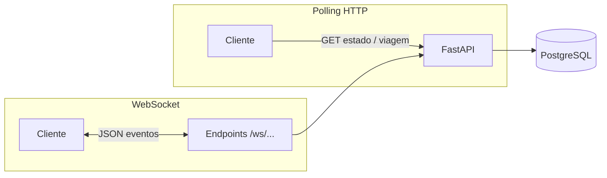
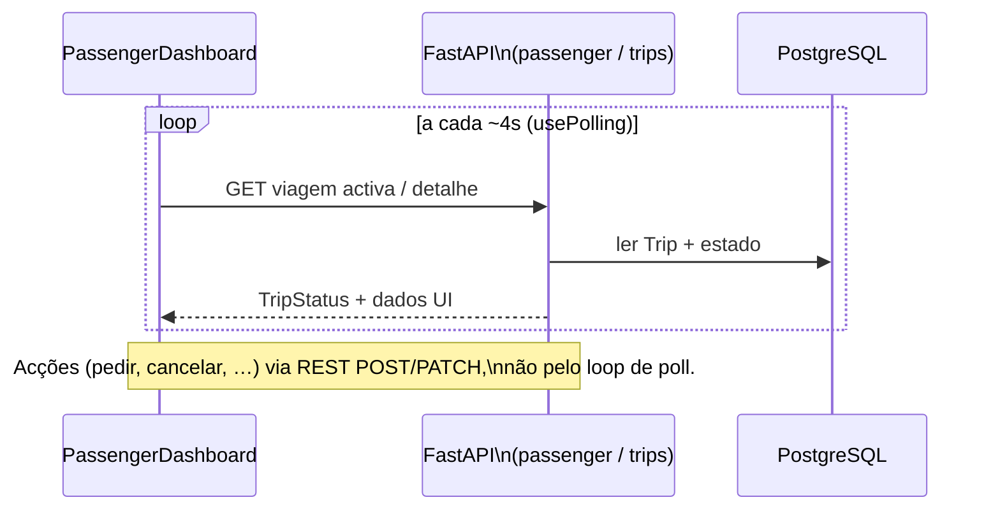
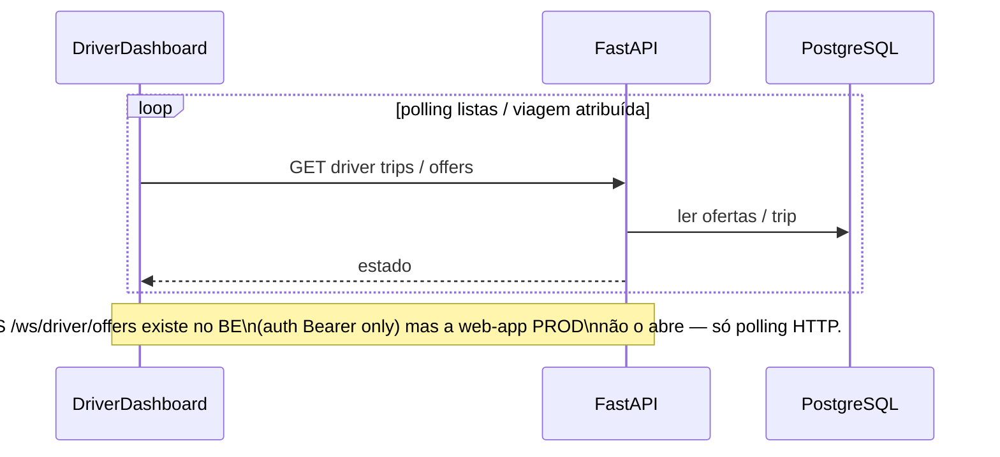
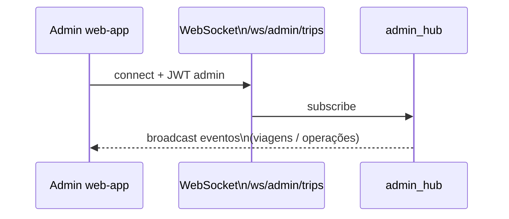

# Diagrama — tempo real (HTTP + WebSocket)

A **web-app** usa sobretudo **polling HTTP** (`usePolling`, intervalos da ordem dos **segundos** — ex.: ~4s no passageiro) — **é o mecanismo actual em PROD**. O **backend** expõe **WebSockets** para subscrições por `trip_id`, por motorista (ofertas) e admin; o frontend **não** os consome hoje.

Rotas WS: `backend/app/api/routers/ws.py` (`/ws/trips/{trip_id}`, `/ws/driver/offers`), `admin_ws.py` (`/ws/admin/trips`). Auth WS: **apenas** header `Authorization: Bearer <jwt>` (L-SEC-10 — sem `?token=`). Clientes browser-native WebSocket não enviam esse header; activar WS no frontend exige um mecanismo próprio (fora deste diagrama) **antes** de ligar o cliente.

```mermaid
flowchart LR
  subgraph poll["Polling HTTP"]
    P1[Cliente]
    P1 -->|GET estado / viagem| API[FastAPI]
  end

  subgraph push["WebSocket"]
    P2[Cliente]
    P2 <-->|JSON eventos| WS[Endpoints /ws/...]
    WS --> API
  end

  API --> DB[(PostgreSQL)]
```

## Passageiro — polling de viagem activa

```mermaid
sequenceDiagram
  participant UI as PassengerDashboard
  participant API as FastAPI\n(passenger / trips)
  participant DB as PostgreSQL

  loop a cada ~4s (usePolling)
    UI->>API: GET viagem activa / detalhe
    API->>DB: ler Trip + estado
    API-->>UI: TripStatus + dados UI
  end

  Note over UI,API: Acções (pedir, cancelar, …) via REST POST/PATCH,\nnão pelo loop de poll.
```

## Motorista — polling + canal WS de ofertas (API)

```mermaid
sequenceDiagram
  participant UI as DriverDashboard
  participant API as FastAPI
  participant DB as PostgreSQL

  loop polling listas / viagem atribuída
    UI->>API: GET driver trips / offers
    API->>DB: ler ofertas / trip
    API-->>UI: estado
  end

  Note over UI,API: Canal WS /ws/driver/offers existe no BE\n(auth Bearer only) mas a web-app PROD\nnão o abre — só polling HTTP.
```

## Admin — WS de viagens

```mermaid
sequenceDiagram
  participant UI as Admin web-app
  participant API as WebSocket\n/ws/admin/trips
  participant Hub as admin_hub

  UI->>API: connect + JWT admin
  API->>Hub: subscribe
  Hub-->>UI: broadcast eventos\n(viagens / operações)
```

## Leitura cruzada

- Estados da viagem: [01_TRIP_LIFECYCLE.md](01_TRIP_LIFECYCLE.md)
- Ofertas: [02_OFFERS.md](02_OFFERS.md)

Índice: [README.md](README.md)
