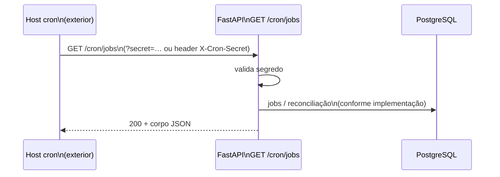

# Diagrama — cron e jobs agregados

O host externo (ex.: cron-u.org ou similar) chama a API com o header **`X-Cron-Secret`** alinhado a `CRON_SECRET`. Documentação operacional: `docs/CRON_JOB_ORG_INSTRUCOES.md`, `docs/ops/OPERATION_CHECKLIST.md`.

Índice: [README.md](README.md)
