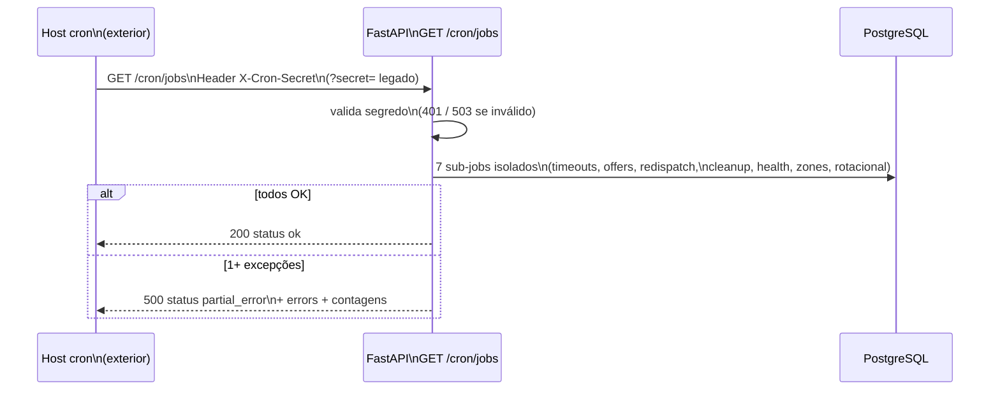

# Diagrama — cron e jobs agregados

O host externo (ex.: [cron-job.org](https://cron-job.org) ou Render Cron) chama a API com o header **`X-Cron-Secret`** alinhado a `CRON_SECRET`. Query `?secret=` é legado.

Documentação operacional: [`docs/CRON_JOB_ORG_INSTRUCOES.md`](../CRON_JOB_ORG_INSTRUCOES.md), smoke curto [`docs/ops/W1_PROD_SMOKE.md`](../ops/W1_PROD_SMOKE.md).

```mermaid
sequenceDiagram
  participant H as Host cron\n(exterior)
  participant API as FastAPI\nGET /cron/jobs
  participant DB as PostgreSQL

  H->>API: GET /cron/jobs\nHeader X-Cron-Secret\n(?secret= legado)
  API->>API: valida segredo\n(401 / 503 se inválido)
  API->>DB: 7 sub-jobs isolados\n(timeouts, offers, redispatch,\ncleanup, health, zones, rotacional)
  alt todos OK
    API-->>H: 200 status ok
  else 1+ excepções
    API-->>H: 500 status partial_error\n+ errors + contagens
  end
```

Índice: [README.md](README.md)
