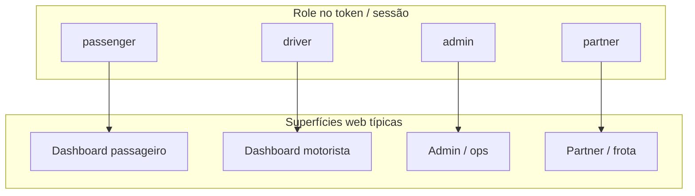

# Diagrama — papéis e superfícies

Valores de `Role` em `backend/app/models/enums.py`. As rotas exactas estão na API e no router do `web-app` (ex.: `/passenger`, `/driver`, `/admin`, `/partner`).

## Leitura cruzada

- Onboarding técnico de frota: [`docs/PARTNER_ONBOARDING.md`](../PARTNER_ONBOARDING.md)

Índice: [README.md](README.md)
