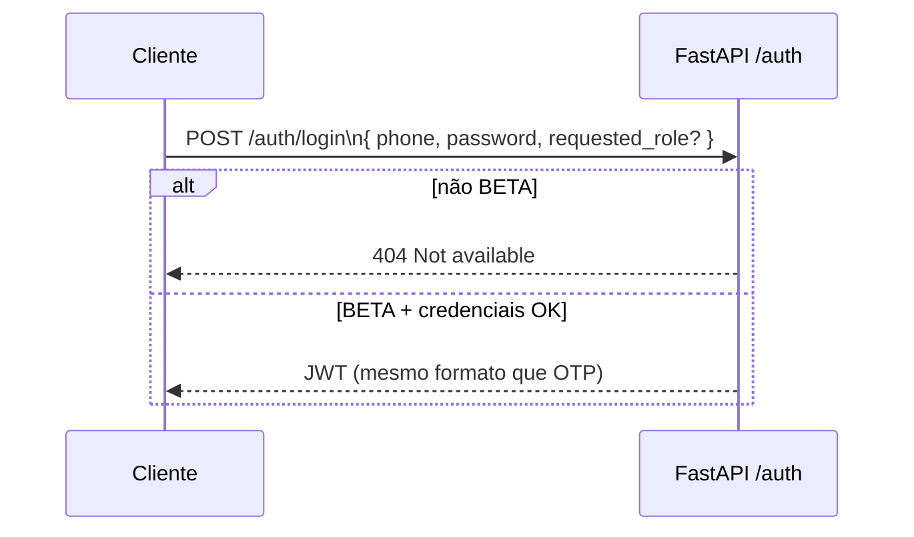

# Diagrama — autenticação OTP (e BETA login)

Rotas: `backend/app/api/routers/auth.py` — `POST /auth/otp/request`, `POST /auth/otp/verify`; em BETA também `POST /auth/login` (telefone + palavra-passe por defeito).

**SMS:** em `dev` o código pode ir para **consola** (`print`); produção real exige gateway SMS (fora deste diagrama).

## Pedido + verificação OTP

```mermaid
sequenceDiagram
  participant C as Cliente (web-app)
  participant A as FastAPI /auth
  participant DB as PostgreSQL

  C->>A: POST /auth/otp/request\n{ phone, requested_role? }
  A->>A: normalizar telefone;\nBETA: limite MAX_BETA_USERS
  A->>A: gerar código;\nhash + expiração
  A->>DB: INSERT OtpCode
  A-->>C: { request_id, expires_at }

  Note over C,A: Em dev: código no log do servidor.

  C->>A: POST /auth/otp/verify\n{ phone, code, requested_role? }
  A->>DB: SELECT OtpCode válido
  A->>A: verificar hash;\nconsumir OTP
  alt novo utilizador
    A->>DB: INSERT User\n(passenger pending em BETA\ncom requested_role driver/passenger)
  else admin_phone
    A->>DB: User role admin
  end
  alt status pending ou blocked
    A-->>C: 403 pending_approval / blocked
  else active
    A->>A: create_access_token
    A-->>C: JWT + user_id + role
  end
```

## BETA — login sem OTP



## Parceiro

Não há signup público para `Role.partner` — gestores de frota são criados por **admin** (`POST /admin/partners/.../create-admin`). Ver [06_ROLES_AND_ROUTES.md](06_ROLES_AND_ROUTES.md).

Índice: [README.md](README.md)
