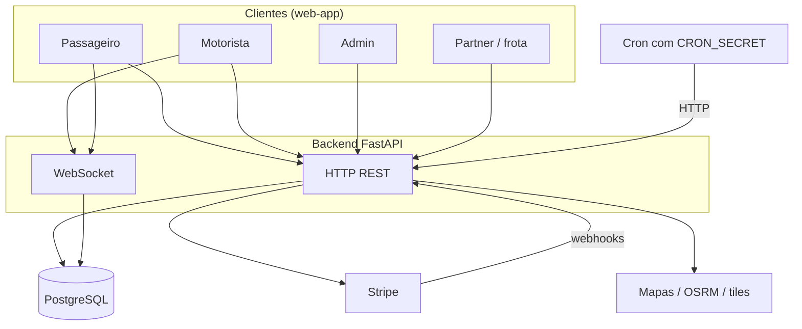

# Diagramas (Mermaid) — TVDE

Pasta **só para fluxos em Mermaid**: cada ficheiro `.md` foca num eixo (viagem, ofertas, pagamentos, …). O **canónico** é o bloco ` ```mermaid ` nesse ficheiro.

## Como ver

- **GitHub:** abrir o `.md` no repositório — o renderizador do GitHub mostra Mermaid **sem** extensão nem site.
- **IDE:** opcional — extensão de preview Markdown com suporte Mermaid se quiseres ver localmente.

## Índice dos fluxos

| #   | Fluxo                                                           | Ficheiro                                         | Notas                                        |
| --- | --------------------------------------------------------------- | ------------------------------------------------ | -------------------------------------------- |
| 0   | **Mapa do sistema** (clientes → API → dados → externos)         | _este README, § abaixo_                          | Visão de contexto; não substitui o blueprint |
| 1   | **Ciclo de viagem** (`TripStatus`)                              | [01_TRIP_LIFECYCLE.md](01_TRIP_LIFECYCLE.md)     | Estados oficiais no backend                  |
| 2   | **Ofertas ao motorista** (`OfferStatus`)                        | [02_OFFERS.md](02_OFFERS.md)                     | Liga a `offer_dispatch` / timeouts           |
| 3   | **Pagamento** (`PaymentStatus` + Stripe)                        | [03_PAYMENTS.md](03_PAYMENTS.md)                 | Webhook e estados internos                   |
| 4   | **Tempo real** (polling + WebSocket)                            | [04_REALTIME.md](04_REALTIME.md)                 | Superfícies web                              |
| 5   | **Cron e jobs agregados**                                       | [05_CRON.md](05_CRON.md)                         | `GET /cron/jobs`, segredo, host externo      |
| 6   | **Papéis e superfícies** (passenger / driver / admin / partner) | [06_ROLES_AND_ROUTES.md](06_ROLES_AND_ROUTES.md) | Alinhado a `Role` no backend                 |

Quando acrescentares um fluxo novo, **actualiza esta tabela** e, se fizer sentido, uma linha em [`docs/meta/DOCS_INDEX.md`](../meta/DOCS_INDEX.md).

---

## 0. Mapa do sistema (contexto)

Diagrama **simplificado** — ligações lógicas, não todos os endpoints.



---

## Manutenção

- Preferir **diagramas pequenos** por ficheiro; dividir em dois ficheiros a um «mega» difícil de rever em PR.
- Se o código mudar estados ou URLs, **actualizar o Mermaid** no mesmo PR que a alteração (ou logo a seguir).
