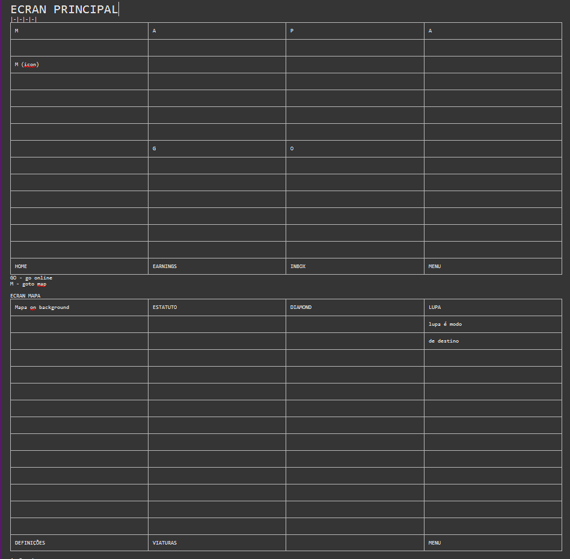

# Ecrã principal motorista — «Top 3» Manel (esboço 2026-05)

Documento **canónico** para o fluxo acordado com **Manel**: substituir / preceder o layout actual do `DriverDashboard` por um **fluxo em dois ecrãs** — mapa largo + disponibilidade, depois ecrã de trabalho com **acções em baixo**.  
Complementa [`DRIVER_MENU_SPEC.md`](DRIVER_MENU_SPEC.md) (menu **Menu** continua a existir para preferências, histórico, zonas v1, etc.).

**Estado:** desenho alinhado em sessão (Frank + Manel); existe **implementação parcial** do fluxo em dois passos (`VITE_DRIVER_HOME_TWO_STEP`); o **§9** (shell mapa + barra inferior) e o **§10** (Top 3 + ordem do menu) são a **próxima camada** de produto a fechar em UX e código. A **ordem** no §10 é **proposta canónica** até o Manel afinar; depois só se troca a ordem, não a lista de destinos.

---

## 1. Objectivo do produto

- Reduzir ruído: **um ecrã para “estar ou não no jogo”** com contexto geográfico claro.
- Depois de **activo / disponível**, o motorista entra no **modo operação** com **botões grandes** ao pé do polegar (aceitar fluxo, navegação, estado da viagem, etc. — detalhe por fatia).
- Manter **regras não restritivas** (ver `DRIVER_MENU_SPEC.md` §5): o toggle não deve “punir” por tentativa honesta de voltar a disponível; mensagens claras se GPS ou rede falharem.

---

## 2. Ecrã 1 — «Mapa + contexto + inactivo/activo»

| Elemento | Comportamento esperado (v1 alvo) |
|----------|----------------------------------|
| **Mapa** | Ocupa **área larga** (viewport principal); mostra posição (e, quando existir, rota ou área útil). Fallback coerente com o actual (demo / última posição servidor). |
| **Inactivo / activo** | Controlo **claro** (ex.: toggle ou dois estados) para **não disponível** vs **disponível para receber pedidos**. Sincronizar com o conceito actual de offline/disponível sem surpresas para quem já usa a app. |
| **Info adicional** | Pequena zona de texto ou ícones (rede, GPS, próximo reset zonas, lembrete bateria — **priorizar 1–2 linhas**; evitar painel denso). Lista exacta **fecha em UX** antes do primeiro PR de implementação. |
| **Transição** | Só quando passa a **activo/disponível** é que navega para o **Ecrã 2** (ou revela o ecrã 2 no mesmo route — decisão de implementação: **stack vs route**; documentar na PR). |

**Casos limite (Ecrã 1):**

- GPS indisponível: mensagem curta + acção «tentar outra vez» (reuso de padrões actuais).
- Rede fraca: não bloquear toggle; aviso não intrusivo.
- Viagem já **aceite / em curso**: não forçar o motorista a “desactivar” sem sentido — **comportamento actual** de priorizar `ActiveTripActions` mantém-se como referência; o esboço não pode quebrar isso.

---

## 3. Ecrã 2 — «Modo operação + botões em baixo»

| Elemento | Comportamento esperado (v1 alvo) |
|----------|----------------------------------|
| **Conteúdo central** | Lista de pedidos / cartão de viagem activa / estado vazio — **reutilizar** componentes actuais (`RequestCard`, `TripCard`, `ActiveTripActions`) sempre que possível. Copy sobre **estimativa vs preço final** não deve ocupar o cabeçalho do ecrã — fica no **Menu** (condições legíveis ao motorista). |
| **Botões em baixo** | Faixa fixa (safe-area) com **2–4 acções máx.** por contexto: ex. aceitar / recusar, abrir navegação, menu, estado da viagem. **Não** duplicar tudo do menu lateral de uma vez. |
| **Regresso ao Ecrã 1** | Passar a **inactivo** ou gesto «voltar» — definir na PR (evitar dead-ends). |

---

## 4. Fora de âmbito nesta onda (explícito)

- Paridade feature-a-feature com Uber/Bolt (ver benchmarks em `docs/research/driver-app-benchmarks.md` só como inspiração).
- Novo sistema de zonas além do **contrato v1** já em `DRIVER_MENU_SPEC.md` §7 (integração futura: ecrã 1 pode **mostrar** resumo de orçamento zonas, mas não é obrigatório na primeira fatia).
- Alterações legais / novos documentos — continuam no **admin**.

---

## 5. Prompts (copiar para sessões de implementação)

### 5.1 Prompt «antes de codificar»

```
Contexto: implementar o fluxo em 2 ecrãs do ficheiro docs/product/DRIVER_HOME_TOP3_MANEL.md
Regras: não alterar contrato de API sem PR à parte; reutilizar RequestCard/TripCard/ActiveTripActions onde couber;
Não expandir o menu Menu nesta PR; feature-flag se necessário para deploy seguro.
Entregável: lista de ficheiros tocados + screenshots ou notas de smoke + risco residual.
```

### 5.2 Prompt «definição de feito» (PR)

- [ ] Ecrã 1: mapa largo + toggle inactivo/activo + pelo menos **uma** linha de info contextual acordada.
- [ ] Activar → utilizador vê Ecrã 2 com **faixa inferior** de botões; **sem** regressão em viagem activa (aceitar → ongoing → complete).
- [ ] Desactivar → regresso previsível ao Ecrã 1 (ou estado equivalente documentado).
- [ ] Smoke manual: disponível → vê pedido → offline → pedido some → online → pedido volta (já validado em prod; repetir após refactor).
- [ ] Telemóvel 360–400px: áreas tácteis ≥ 44px nos botões inferiores.

### 5.3 Prompt «não fazer nesta PR»

- Redesenhar histórico completo, documentos, zonas v1, admin.
- Novos endpoints só se o fluxo **exigir** — preferir composição de estado no cliente.

---

## 6. Métricas (v1 mínimo — evolução por fases)

| Métrica | O quê medir | Onde (ideal) | Notas v1 |
|---------|-------------|----------------|----------|
| **M1 — Tempo até «activo»** | Segundos entre abrir app (Ecrã 1) e primeiro toggle para disponível | `log_event` ou analytics futuro | Smoke: cronómetro manual nas primeiras sessões |
| **M2 — Abandono Ecrã 1** | Sessões que fecham app sem nunca passar a disponível | idem | Definir «sessão» (ex.: foreground > 30s) quando houver telemetria |
| **M3 — Erro GPS no Ecrã 1** | Contagem de fallback / retry | reutilizar padrão GPS actual | Comparar antes/depois do refactor |
| **M4 — Regressão lista pedidos** | Taxa de erro ao listar `available` após mudança de ecrã | logs API + UI | Manter smoke #2 do `TODOdoDIA` |
| **M5 — Acções inferiores** | Toques em cada botão da faixa (quando existir instrumentação) | futuro | Opcional pós-MVP |

**Princípio:** até existir pipeline de analytics, **M1–M4** podem ser verificadas por **smoke + logs existentes** + notas no `TODOdoDIA`.

---

## 7. Próximo passo recomendado (código)

1. **Spike UI** (1 PR): layout shell — Ecrã 1 + navegação para Ecrã 2 mock ou vazio, feature-flag `VITE_DRIVER_HOME_TWO_STEP` (ou equivalente).
2. **Integração**: encaixar lista actual e `ActiveTripActions` no Ecrã 2.
3. **Remover flag** quando smoke em produção estiver verde.

---

## 8. Referências

- **§10** — Top 3 + ordem completa do menu motorista (proposta canónica até feedback Manel).
- [`DRIVER_MENU_SPEC.md`](DRIVER_MENU_SPEC.md) — menu, rendimentos, histórico, zonas v1; **§7** mudanças de zona / excepção partner; **§7.8** smoke UI motorista (menu no topo, GPS, copy estimativa).
- [`driver-app-benchmarks.md`](../research/driver-app-benchmarks.md) — contexto competitivo; **§6** — capturas LIS (fila aeroporto / zona de espera, ref. Manel).
- [`UX_MINI_ROADMAP_E_PROMPTS.md`](../prompts/UX_MINI_ROADMAP_E_PROMPTS.md) — princípios gerais de UX web.

---

## 9. Wireframe Manel — mapa em «background» + barra inferior (2026-05-03)

Referência visual (rascunho 4×4):



### 9.1 O que **não** queremos («vazio»)

- **Não** reservar uma faixa alta do ecrã só a conteúdo estático ou a um «painel vazio» quando o mapa devia dar contexto. O **mapa preenche o fundo** do shell principal; texto e controlos sobrepõem-se de forma compacta (Uber / Lyft).

### 9.2 Mapa sempre visível (mesmo indisponível / GPS fraco)

- O mapa permanece em **background** em **HOME** (ecrã principal).
- Quando o motorista está **offline**, **GPS fraco** ou ainda sem posição fiável, mostrar na mesma **área aproximada** (raio da ordem de **5–10 km** — valor exacto a calibrar em UX) com **pistas úteis**: posição aproximada, última posição conhecida no servidor, ou vista centrada numa **zona do catálogo** próxima.
- Objectivo Manel: o motorista **vê possibilidades** na região e pode **escolher uma zona próxima** para «começar» (alinhar com catálogo de zonas e fluxo de sessão em `DRIVER_MENU_SPEC.md` **§7**), em vez de um ecrã morto.

### 9.3 Barra inferior fixa (alinhamento Uber / Lyft)

Ordem alvo: **HOME** | **EARNINGS** | **INBOX** | **MENU** (safe-area, sempre visível no shell principal).

| Tab | Comportamento |
|-----|----------------|
| **HOME** | Volta ao **mapa** (ecrã principal com mapa em fundo). |
| **EARNINGS** | Rendimentos / resumo (reutilizar rotas ou conteúdo já previsto no menu; pode ser placeholder até haver ecrã dedicado). |
| **INBOX** | Caixa de entrada / avisos (placeholder ou integração futura). |
| **MENU** | Abre o **menu** lateral ou painel já existente (`DriverOperationsMenu` / spec §7.8). |

### 9.4 GO / disponível e controlos sobre o mapa

- **GO** (ou estado **activo / disponível**) fica **no centro**, **sobre o mapa**, visualmente **pequeno** (FAB ou pill), não numa gaveta separada do mapa.
- Outros botões (ex.: atalho mapa, filtros) podem ser **pequenos overlays** no mapa, sem duplicar toda a navegação do Menu.

### 9.5 Ecrã «mapa activo» — topo: ESTATUTO, DIAMOND, LUPA

- **ESTATUTO** — estado operacional (offline / disponível / em viagem, etc.).
- **DIAMOND** — tier / programa (referência competitiva; ver benchmarks §3).
- **LUPA** — **modo destino** (filtro de direcção / destino para o motorista alinhado ao mental model tipo Uber destination filter).

### 9.6 «Mais um destino» / limite de mudanças — pedido ao **partner**

- Quando o orçamento diário de **mudanças de zona** estiver esgotado (ex. **2/2**), a UI **não** pode ficar só com texto morto: deve existir caminho claro para o motorista **pedir ao partner** uma **mudança extra** ou **extensão** (mensagem, formulário curto, ou deep-link para fluxo partner).
- Regras e API alvo: `DRIVER_MENU_SPEC.md` **§7** (ex.: `POST …/request-extension`, aprovação partner, `consume_reason` / `partner_override`).
- Até o endpoint e o painel partner estarem prontos: CTA visível + copy honesta («Enviaremos o pedido quando a função estiver activa») ou canal já usado pela operação — **evitar** sensação de «app partida».

---

## 10. Top 3 + ordem do menu motorista (proposta canónica — 2026-05-03)

Alinhado ao que **já existe** no código (`DriverOperationsMenu` + ícones **Conta** / **Configurações** no cabeçalho via `ProfileButton` / `SettingsButton`) e à barra inferior do **§9**.

### 10.1 O que significa «Top 3» aqui

Os **três destinos** que o motorista deve encontrar **sem esforço** (barra inferior **e** topo do conteúdo do Menu):

| # | Destino | Racional (1 linha) |
|---|---------|-------------------|
| **1** | **Rendimentos (Earnings)** | Motivação e clareza financeira imediata. |
| **2** | **Viagens** | Lista + detalhe (histórico) — o «livro de bordo» do dia. |
| **3** | **Inbox** | Avisos do partner / sistema; hoje pode ser **placeholder** ou atalho ao registo de actividade até haver API dedicada. |

Na **barra inferior** (§9.3), isso mapeia directamente: **HOME** | **EARNINGS** | **INBOX** | **MENU**.

### 10.2 Ordem completa **dentro** do painel «Menu do motorista»

Ordem de **scroll** sugerida (blocos / secções). **Conta** e **Definições** ficam também no cabeçalho; no menu repetimos como **atalhos** que abrem os **mesmos** fluxos já existentes (zero duplicação de lógica).

1. **Cabeçalho** — título, Fechar, linha de contexto (nome / taxa cancelamento), badge rating quando existir.
2. **Rendimentos** — semana actual / anterior (como hoje).
3. **Viagens** — bloco actual «Histórico de viagens» (só renomear copy para **Viagens** se quiserem linguagem única com a barra).
4. **Inbox** — secção curta: «Sem novidades» ou lista v1 + link «Ver registo de actividade» se fizer sentido.
5. **Conta (perfil)** — atalho: abre **Conta** (BETA / palavra-passe / dados) igual ao botão perfil.
6. **Definições** — atalho: abre **Configurações** (sheet/dialog actual).
7. **Preços nos pedidos (estimativa)** — `<details>` (como hoje).
8. **Mudança de zona (v1)** — orçamento, sessão, extensão (como hoje).
9. **Navegação (preferência)** — Waze / Google (como hoje).
10. **Categorias de veículo** — toggles (como hoje).
11. **Documentos e licenças** — (como hoje).
12. **Admin** — só se `isAdmin`: link painel admin (como hoje).

### 10.3 O que **não** muda na primeira PR de reordenação

- Contratos de API, regras de zonas, GPS, two-step: **só** reordenação de JSX / rotas de atalho e labels.
- **EARNINGS** na barra pode abrir o menu já com **scroll** ou âncora na secção Rendimentos — decisão de implementação; o conteúdo canónico continua no Menu até haver ecrã dedicado.

### 10.4 Ajuste com o Manel

Quando houver ranking final: permutar linhas **2–4** (ex.: Inbox acima de Viagens) **sem** retirar Conta, Definições, Zonas, Navegação, Categorias ou Documentos da lista.
