# TVDE — Navigation dependency map (read-only)

**Scope:** `web-app/src` · inventory only — no redesign proposals implemented here.

**Evidence base:** routes, side menus, bottom navs, dashboards, feature flags (code @ `main` post-merge PR #349).

**State legend:** `IMPLEMENTED` · `PARTIAL` · `MOCK` · `PLACEHOLDER` · `HIDDEN` · `DEAD` · `BACKEND_ONLY` · `FLAG_OFF` · `UNCONFIRMED`

**Architecture:** Passenger, Driver, and most Partner screens use **one React Router path** + **in-app state** (sheet menus, bottom nav, overlays). Admin uses **one path + query tabs**. Partner adds **2 deep URL routes**.

**Related:** [`ambiance-chrome-contract.md`](ambiance-chrome-contract.md) · [`shell-menu-centric.md`](shell-menu-centric.md) · [`shell-menu-ia-canonical.md`](shell-menu-ia-canonical.md)

**Diagram suffixes:** `[PARTIAL]` · `[MOCK]` · `[HIDDEN]` · `[DEAD]` — critical gaps only.

---

## Overview — single navigation map

```mermaid
flowchart TD
  LOGIN["Login / role redirect"] --> P_ENTRY
  LOGIN --> D_ENTRY
  LOGIN --> PT_ENTRY
  LOGIN --> A_ENTRY

  subgraph PASSENGER["Passenger · /passenger"]
    P_ENTRY["/passenger"] --> P_BN["Bottom nav"]
    P_BN --> P_HOME["Home → map"]
    P_BN --> P_HIST["History"]
    P_BN --> P_ACCT["Account"]
    P_BN --> P_MENU["Menu"]
    P_MENU --> P_SM["Side menu"]
    P_SM --> P_TRIPS["Trips · QR share · history detail"]
    P_SM --> P_SET["App · Settings"]
    P_HOME --> P_FLOW["Trip: plan → active"]
    P_FLOW --> P_PAY["Payment states"]
    P_HDR["Header settings [HIDDEN]"]
  end

  subgraph DRIVER["Driver · /driver"]
    D_ENTRY["/driver"] --> D_BN["Bottom nav"]
    D_BN --> D_HOME["Home → map · offers"]
    D_BN --> D_EARN["Earnings"]
    D_BN --> D_INBOX["Inbox"]
    D_BN --> D_MENU["Menu"]
    D_MENU --> D_SM["Side menu"]
    D_SM --> D_OPS["Ops · trips · activity"]
    D_SM --> D_ACC["Account · profile · docs"]
    D_SM --> D_CFG["Config · zones · nav · settings"]
    D_HOME --> D_TRIP["Active trip"]
    D_CFG --> D_PRICE["Pricing info (renamed)"]
    D_DEAD["Legacy screens — pruned W1"]
  end

  subgraph PARTNER["Partner / Frota · /partner"]
    PT_ENTRY["/partner"] --> PT_BN["Bottom nav"]
    PT_BN --> PT_HOME["Home · KPIs · alerts"]
    PT_BN --> PT_FLEET["Fleet → hub"]
    PT_BN --> PT_INBOX["Inbox"]
    PT_BN --> PT_MENU["Menu"]
    PT_MENU --> PT_SM["Side menu"]
    PT_SM --> PT_FHUB["Fleet hub"]
    PT_SM --> PT_THUB["Trips hub"]
    PT_SM --> PT_REP["Reports [PARTIAL]"]
    PT_FHUB --> PT_MAP["Fleet map"]
    PT_THUB --> PT_EXPORT["Export CSV [PARTIAL]"]
    PT_FLEET --> PT_DEEP_D["/drivers/:userId"]
    PT_THUB --> PT_DEEP_T["/trips/:tripId"]
    PT_SEARCH["Home search [PARTIAL]"]
    PT_NOMENU["Menu on deep routes [HIDDEN]"]
  end

  subgraph ADMIN["Admin · /admin"]
    A_ENTRY["/admin ?tab="] --> A_TABS["Tab bar"]
    A_TABS --> A_AGORA["Agora"]
    A_TABS --> A_TRIPS["Trips · ?tripId"]
    A_TABS --> A_OPS["Ops [PARTIAL]"]
    A_TABS --> A_REST["Docs · Users · Frota · Metrics · Health · …"]
    A_LINK["Settings link [HIDDEN]"]
  end
```

---

## Global routes

Source: `web-app/src/routes/index.tsx`

| Route | Gate | Component | Nav model |
|-------|------|-----------|-----------|
| `/` | auth | `RootRedirect` | → `/admin` / `/partner` / `/driver` / `/passenger` |
| `/passenger` | `PassengerOnly` | `PassengerDashboard` | Single page + overlays |
| `/driver` | `DriverOnly` | `DriverDashboard` | Single page + overlays |
| `/partner` | `PartnerGate` | `PartnerLayout` → index | Shell + menu state |
| `/partner/drivers/:userId` | partner | `PartnerDriverDetail` | Deep route |
| `/partner/trips/:tripId` | partner | `PartnerTripDetail` | Deep route |
| `/admin` | `isAdmin` | `AdminDashboard` | Query tabs `?tab=` |
| `/admin/login` | — | redirect → `/admin` | Legacy alias |
| `/download`, `/dl`, `/app` | public | download landing/redirect | External entry |
| `/debug/map` | **DEV only** | `DebugMapPage` | No UI link |
| `/auth/google/callback` | beta unauth | `GoogleOAuthCallback` | OAuth redirect |

**Header:** `/passenger`, `/driver`, `/partner` → `AppHeaderBar` **`userCompact`** (no Profile/Settings). `/admin` → **`default`** (Profile + Settings visible).

---

## 1. Passenger

### Summary

| | |
|---|---|
| **Main nav** | Bottom nav (Home · History · Account · Menu) + left sheet on `/passenger` |
| **Strengths** | Clear 4-tab shell; map-centric trip flow; menu sections aligned with partner (O-2) |
| **Inconsistencies** | Settings & Share QR only in side menu; no header Profile/Settings on compact shell |
| **UX risks** | History read-only (no trip detail); payment depends on Stripe env |

---

## 2. Driver

### Summary

| | |
|---|---|
| **Main nav** | Bottom nav (Home · Earnings · Inbox · Menu) + left sheet (Operations · Account · Config) |
| **Strengths** | Richest menu tree; real API for inbox, docs, zones, trips; wayfinding highlight (O-3) |
| **Inconsistencies** | Many screens menu-only; hidden Profile/Settings still wired via custom events |
| **UX risks** | Placeholder copy (compliance hours, pricing, rating); dead legacy menu states |

---

## 3. Partner / Fleet

### Summary

| | |
|---|---|
| **Main nav** | Bottom nav (Home · Fleet · Inbox · Menu) + left sheet with hub/leaf screens |
| **Strengths** | Hub pattern (Fleet, Trips); deep URLs for driver/trip detail; alerts on home |
| **Inconsistencies** | Bottom Fleet skips hub → list; side menu absent on deep routes; home search ≠ home KPIs |
| **UX risks** | CSV export ignores list filters; reports screen notes “future phases” |

---

## 4. Admin

### Summary

| | |
|---|---|
| **Main nav** | Horizontal tab bar on `/admin?tab=` — no side menu |
| **Strengths** | 10 tabs wired to live admin APIs; deep link `?tab=trips&tripId=` |
| **Inconsistencies** | Only role with URL-query tabs; admin entry mostly via Settings on non-compact shells |
| **UX risks** | Destructive ops gated by `super_admin` JWT (visible but disabled) |

Tab IDs: `agora`, `docs`, `pending`, `users`, `frota`, `dados`, `trips`, `metrics`, `ops`, `health` — see `adminDashboardQuery.ts`.

---

## Cross-app matrix

| APP | Entrada UI | Destino | Rota | Componente | Estado | Problema | Prioridade |
|-----|------------|---------|------|------------|--------|----------|------------|
| Passenger | Bottom Home | Map home | `/passenger` | `PassengerDashboard` | IMPLEMENTED | — | — |
| Passenger | Bottom History | History list + detail | `/passenger` | `PassengerSideMenu` | IMPLEMENTED | Tap → `history_detail` | — |
| Passenger | Bottom Account | BETA account | `/passenger` | `BetaAccountPanel` | IMPLEMENTED | BETA APIs | Baixa |
| Passenger | Menu → Settings | Appearance | `/passenger` | `AppAppearanceSettings` | IMPLEMENTED | Not in bottom nav | Baixa |
| Passenger | Menu → Share QR | QR screen | `/passenger` | `PassengerSideMenu` | IMPLEMENTED | Not in bottom nav | Baixa |
| Passenger | Trip flow | Pay / active trip | `/passenger` | dashboard overlays | IMPLEMENTED | Mock/skip/retry states | — |
| Passenger | Header Settings | Full panel | — | `SettingsButton` | HIDDEN | Compact shell | Média |
| Driver | Bottom Home | Map / offers | `/driver` | `DriverDashboard` | IMPLEMENTED | — | — |
| Driver | Bottom Earnings | Earnings | `/driver` | `DriverOperationsMenu` | IMPLEMENTED | — | — |
| Driver | Bottom Inbox | Messages | `/driver` | `DriverInboxPanel` | IMPLEMENTED | — | — |
| Driver | Menu → Pricing | Info only | `/driver` | `DriverOperationsMenu` | IMPLEMENTED | Renamed «Como funciona a estimativa» | — |
| Driver | Menu → Zones request | Zone change | `/driver` | zones sub-screens | IMPLEMENTED | Honest ops copy | — |
| Driver | Compliance banners | Hours limits | `/driver` | `DriverDashboard` | IMPLEMENTED | API-driven copy | — |
| Driver | Menu `all` / `account` | Legacy | — | — | REMOVED | W1 cleanup | — |
| Driver | `DriverShellTopChips` | — | — | — | REMOVED | W1 cleanup | — |
| Partner | Bottom Home | Dashboard | `/partner` | `PartnerHomeDashboard` | IMPLEMENTED | — | — |
| Partner | Home search | — | `/partner` | — | REMOVED | B1: search só em listas | — |
| Partner | Bottom Fleet | Fleet hub | `/partner` | `PartnerFleetHubScreen` | IMPLEMENTED | Via bottom nav | — |
| Partner | Menu → Export | CSV | `/partner` | `PartnerTripsExportScreen` | IMPLEMENTED | Filtered export API | — |
| Partner | Menu → Reports | KPIs + CSV | `/partner` | `PartnerReportsMenuScreen` | IMPLEMENTED | tripStats + export | — |
| Partner | List → driver | Driver detail | `/partner/drivers/:userId` | `PartnerDriverDetail` | IMPLEMENTED | Menu fecha ao navegar; bottom Frota/Caixa não redirecciona | — |
| Partner | List → trip | Trip detail | `/partner/trips/:tripId` | `PartnerTripDetail` | IMPLEMENTED | Idem deep route | — |
| Admin | Login tab | Dashboard | `/admin` | `AdminDashboard` | IMPLEMENTED | beta gate | — |
| Admin | Tab Agora | Ops summary | `/admin?tab=agora` | `AdminTabAgora` | IMPLEMENTED | Default | — |
| Admin | Tab Trips + tripId | Trip detail | `/admin?tab=trips&tripId=` | `AdminTabTrips` | IMPLEMENTED | Query not path | Baixa |
| Admin | Tab Ops | Cron/reconcile | `/admin?tab=ops` | `AdminTabOps` | PARTIAL | super_admin gates | Média |
| Admin | Settings → Admin | Panel link | `/admin` | `SettingsButton` | HIDDEN | Compact shells | Baixa |
| All | `/debug/map` | Debug map | DEV | `DebugMapPage` | BACKEND_ONLY | No menu link | Baixa |
| All | Menu → Definições | Themes | in-menu | `AppAppearanceSettings` | IMPLEMENTED | Duplicated pattern | Baixa |

---

## Problematic visible entries (resolved W1–W4)

| Entry | App | Resolution |
|-------|-----|------------|
| Home search | Partner | Removed from home; `PartnerListSearch` on list screens only |
| Pricing (estimate) | Driver | Renamed «Como funciona a estimativa» |
| Driving-hours banners | Driver | Compliance API copy |
| Rating chip | Driver | Removed until API exists |
| History list rows | Passenger | Tap → `history_detail` + `getTripDetail` |
| Trips export | Partner | `GET /partner/trips/export` query params |
| Reports | Partner | Honest resumo + filtered CSV |

---

## Routes without UI entry

| Route | Notes |
|-------|-------|
| `/debug/map` | DEV-only |
| `/auth/google/callback` | OAuth redirect |
| `/download`, `/dl`, `/app` | Public / marketing |
| `/admin/login` | Redirect alias |

---

## Dead / hidden nav components (post W1)

| Item | State |
|------|-------|
| `DriverShellTopChips.tsx` | REMOVED (W1) |
| `DriverMenuScreen` `all` / `account` | REMOVED (W1) |
| `DRIVER_OPEN_SETTINGS_EVENT` | REMOVED (W1) |
| `PartnerFleetScreen.tsx`, `PartnerTripsMenuScreen.tsx` | REMOVED / absent (W1) |
| `ProfileButton` / full `SettingsButton` on P/D/Partner | HIDDEN — compact header; `AppRouteModeSwitch` in menu |
| Driver home step-1 | FLAG_OFF (always false) |
| `PartnerSideMenu` on detail URLs | IMPLEMENTED — menu fecha ao **entrar** no detalhe; bottom Frota/Caixa abre menu no detalhe sem mudar URL |

---

## Cross-role inconsistencies

| Topic | Passenger | Driver | Partner | Admin |
|-------|-----------|--------|---------|-------|
| Router depth | 1 path | 1 path | 1 + 2 deep | 1 + query |
| Bottom nav | 4 tabs | 4 tabs | 4 tabs | none |
| Side menu sections | yes | yes | yes | n/a |
| Header Profile/Settings | hidden | hidden | hidden | visible |
| Settings entry | menu | menu | menu | header + login |
| Wayfinding highlight | yes | yes | yes | n/a |

---

## Normalization suggestions (inventory only)

1. Document canonical settings path: Menu → App → Definições for P/D/Partner.
2. Publish single IA table aligning bottom nav vs side menu items.
3. Partner deep routes: remount menu shell or reset navigation before opening menu.
4. Remove or wire dead states: `all`/`account`, `DriverShellTopChips`, orphan partner files, `DRIVER_OPEN_SETTINGS_EVENT`.
5. Replace placeholder copy before broad prod exposure (compliance, pricing, rating).
6. Clarify or wire Partner home search behaviour.
7. Visible admin entry for staff using compact shells.

---

*Last updated: 2026-05-22 — nav fixes W1–W4 (scope C).*
