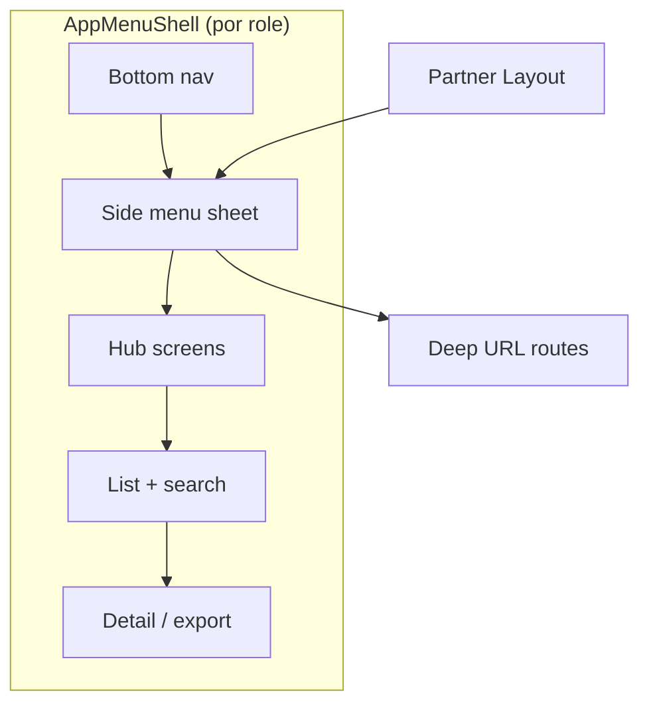

# Shell menu — canonical information architecture (O-NAV-PP-1)

**Status:** v1 — alinhado com PR nav-fixes (W1–W4) · pós #349.

**Princípio:** cada role tem **uma rota React** + **menu lateral (AppMenuShell)** + **bottom nav** quando aplicável. Deep links só onde o produto exige URL partilhável (partner driver/trip detail).

---

## Passenger (`/passenger`)

| Camada | Entrada | Destino |
|--------|---------|---------|
| Bottom nav | Início | Mapa + fluxo viagem |
| Bottom nav | Histórico | Menu → `history` |
| Bottom nav | Conta | Menu → `account` |
| Bottom nav | Menu | `root` side menu |
| Side menu · Viagens | Histórico | Lista → **detalhe** (`history_detail`) |
| Side menu · Viagens | Partilhar app | QR |
| Side menu · App | Definições | Tema + **Modo** (multi-role) |
| Header oculto | Profile / Settings | Substituído pelo menu; modo via `AppRouteModeSwitch` |

---

## Driver (`/driver`)

| Camada | Entrada | Destino |
|--------|---------|---------|
| Bottom nav | Início | Mapa · ofertas |
| Bottom nav | Rendimentos | Menu → `earnings` |
| Bottom nav | Caixa | Menu → `inbox` |
| Bottom nav | Menu | `root` |
| Side menu · Perfil | Perfil / Conta / Docs | Sub-ecrãs legacy ops |
| Side menu · Config | Zonas · Nav · **Como funciona a estimativa** | Sem promessas “em breve” |
| Side menu · App | Definições | Tema + **Modo** (multi-role) |

**Removido / morto:** `DriverShellTopChips`, secções `all`/`account` órfãs, `DRIVER_OPEN_SETTINGS_EVENT`.

---

## Partner (`/partner`)

| Camada | Entrada | Destino |
|--------|---------|---------|
| Bottom nav | Início | Dashboard KPIs + alertas (**sem** search global) |
| Bottom nav | Frota | Menu → hub `fleet` (não salta para lista) |
| Bottom nav | Caixa | `inbox` |
| Bottom nav | Menu | `root` |
| Side menu | Frota / Viagens / Relatórios / … | Hubs + listas |
| Listas | Filtrar lista | Só em `fleet_list` / `trips_list` (NAV-P-02 B1) |
| Export CSV | Filtros activos | `GET /partner/trips/export?status&driver_id&from&to&q` |
| Deep routes | `/partner/drivers/:id`, `/partner/trips/:id` | **Menu montado no Layout** (`PartnerWorkspaceProvider`) |

---

## Admin (`/admin`)

Entrada via Settings (staff) ou URL directa. Tabs por query `?tab=`. Sem side menu partilhado — fora do escopo shell v1.

---

## Cross-role (NAV-X)

| ID | Resolução |
|----|-----------|
| NAV-X-01 | Conta no menu; header Profile/Settings oculto em shell compacto |
| NAV-X-02 | Settings & Share QR só no side menu — intencional |
| NAV-X-03 | `AppRouteModeSwitch` em Definições (passageiro, motorista, admin) |
| NAV-X-04 | Definições menu ≠ painel Settings header — documentado aqui |

---

## Diagrama resumido

**Referência viva:** [`navigation-inventory.md`](navigation-inventory.md)
